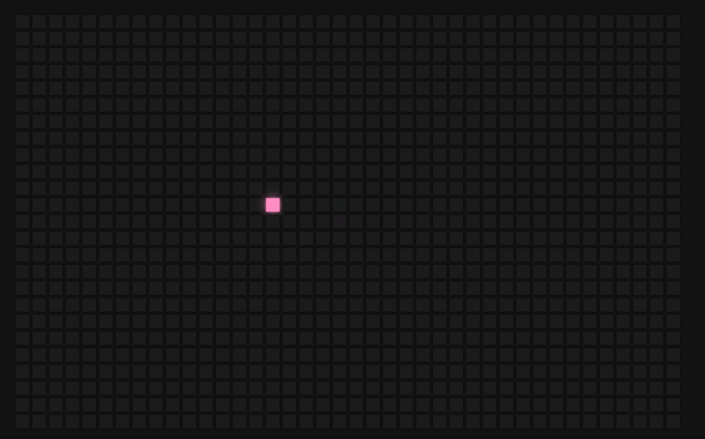

# HoverBoard
 

 

## Very fun project to practice:

- JS Dom manipulation; 
- JS Functions; 
- JS For loop;

 

### Turorial from @FlorinPop
https://www.youtube.com/c/FlorinPop

### More Projects:
https://code-camp-responsive-wd-ld9d03x7e-migsilva89.vercel.app/